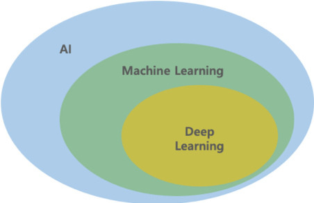
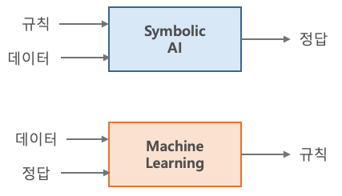
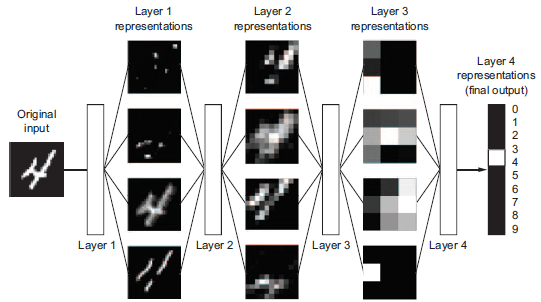
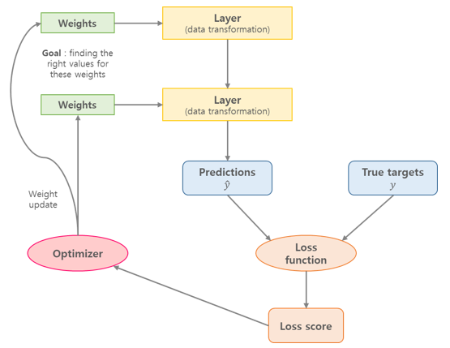

# Chap01 - 딥러닝이란 무엇인가?

## 1.1 인공지능과 머신러닝, 딥러닝

### 1.1.1 인공지능

- 일반적인 사람이 수행하는 지능적인 작업을 자동화하기 위한 연구 활동이다.
- 명시적인 규칙을 충분하게 많이 만들어 인공지능을 만드는 방법을 **심볼릭 AI**(symbolic AI)라고 하며 1950 ~ 1980년대까지 AI 분야의 지배적인 패러다임이었다. 1980년대에는 **전문가 시스템**(expert system)이 인기를 끌었다.
- 심볼릭 AI를 대체하기 위한 새로운 방법이 바로 **머신러닝**이다.

### 1.1.2 머신러닝

- *프로그래머가 직접만든 규칙(rule)대신 컴퓨터가 데이터를 보고 자동으로 규칙을 학습할 수 있을까?* → **머신러닝의 패러다임**

- 데이터에서 통계적 구조를 찾은 뒤, 이 작업을 자동화하기 위한 규칙을 만든다.
- 머신러닝은 명시적으로 프로그래밍되는 것이 아니라 **훈련**(training)된다.

### 1.1.3 데이터에서 표현을 학습하기

- 머신러닝은 데이터와 기대값(정답)이 주어졌을 때 데이터 처리 작업을 위한 실행 규칙을 찾는 것이다. → *Supervised Learning*
- 머신러닝을 하기 위해서는 다음의 세 가지가 필요하다.
  - **입력 데이터 포인트** : 규칙을 찾고자 하는 데이터
  - **기대 출력** : 레이블(label), 정답이라고도 하며, 데이터 포인트에 대응되는 레이블
  - **성능 측정 지표** : 알고리즘의 출력값($\hat{y}$)과 정답($y$)간의 차이를 측정하는 알고리즘 (MSE, CEE) → 차이를 줄여나가는 과정을 **학습**(learning)이라고 함

- 머신러닝/딥러닝 모델은 입력 데이터를 의미있는 출력, 즉 **의미있는 데이터로의 변환**, **유용한 표현**(representation)을 학습하는 것이다. 
- 머신러닝에서의 **학습**(learning)이란 더 나은 표현을 찾는 자동화된 과정이다.
- 머신러닝 알고리즘은 일반적으로 **가설 공간**(hypothesis space)을 사전에 정의하고, 이 공간에 대해 입력 데이터에서 유용한 변환을 찾는 것이다.
- 따라서, 머신러닝은 입력(예: 이미지) 타겟(target, 예: '고양이' 레이블)을 학습하면서 입력을 타겟에 매핑(mapping)하는 것이다.

### 1.1.4 딥러닝에서 '딥'이란 무엇일까?

- 딥러닝은 머신러닝의 특정한 한 분야로서 연속된 **층**(layer)에서 데이터로부터 의미있는 표현을 학습하는 방법이다.
- 딥러닝의 **딥(deep)**은 연속된 층으로 표현을 학습한다는 개념이며, 딥러닝 모델에서 층의 개수가 모델의 **깊이**(depth)가 된다.
- 딥러닝에서는 층을 겹겹이 쌓아 올려 구성한 **신경망**(neural network)이라는 모델을 사용하여 표현 층을 학습 한다.
- 심층 신경망(DNN)은 정보가 연속된 필터(filter)를 통과하면서 순도 높게 정제되는 다단계 정보 추출 작업으로 생각할 수 있다.

### 1.1.5 딥러닝의 작동 원리 이해하기

- 심층 신경망은 '입력-타겟' 매핑을 층을 많이 연결하여 수행한다. 
- 층에서 입력 데이터가 처리되는 상세 내용은 일련의 숫자로 이루어진 층의 **가중치**(weight)에 저장되어 있다.
- 심층 신경망에서의 **학습**은 입력을 타겟에 매핑하기위해 신경망의 모든 층에 있는 가중치 값을 찾는 것이다.

- 딥러닝이 데이터로부터 학습하는 방법에는 두 가지 중요한 특징이 있다.
  - 층을 거치면서 점진적으로 더 복잡한 표현이 만들어진다.
  - 이러한 점진적인 중간 표현이 공동으로 학습된다. 
  
  
  
 
