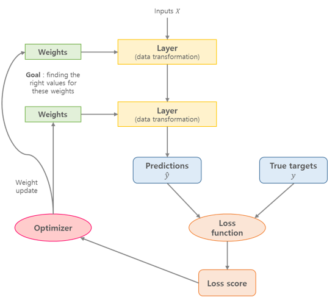
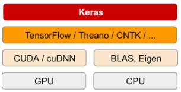

# Chap03 - 신경망 시작하기


## Goals

- [2장](https://github.com/ExcelsiorCJH/Deep-Learning-with-Python/blob/master/Chap02-mathematical_building_blocks_of_neural_networks/Chap02-mathematical_building_blocks_of_neural_networks.ipynb)에서 살펴본 층(layer), 네트워크(network), 목적 함수, 옵티마이저와 같은 신경망의 핵심 구성요소들에 대해 살펴본다.
- 파이썬 딥러닝 라이브러리인 케라스(Keras)에 대해 간략하게 알아본다.
- 다음의 실전 예제를 통해 신경망이 어떻게 사용되는지 알아본다.
  - 영화 리뷰를 긍정 또는 부정으로 분류하기 (이진 분류, binary classification)
  - 신문 기사를 토픽으로 분류하기 (다중 분류, multiclass classification)
  - 부동산 데이터를 바탕으로 주택 가격을 예측하기 (회귀, regression)


## 3.1 신경망의 구조

신경망의 학습에는 다음 요소들이 관련되어 있다.

- **네트워크**(또는 **모델**)을 구성하는 **층(레이어, layer)**
- **입력 데이터** 와 이에 대응되는 **타겟**(또는 레이블)
- 학습에 대한 평가 지표인 **손실함수**(loss function)
- 가중치 파라미터를 업데이트를 결정하는 방법인 **옵티마이저**





### 3.1.1 층: 딥러닝의 구성 단위

- **층(레이어)**은 하나 이상의 텐서(tensor, [2장](https://github.com/ExcelsiorCJH/Deep-Learning-with-Python/blob/master/Chap02-mathematical_building_blocks_of_neural_networks/Chap02-mathematical_building_blocks_of_neural_networks.ipynb) 참고)를 입력으로 받아 하나 이상의 텐서를 출력하는 데이터 처리 모듈이다.
- 어떤 종류의 층은 상태(state)가 없지만 대부분의 경우 **가중치**(weight)라는 층의 상태를 가진다.
  - 플랫튼(Flatten), 풀링(Pooling), 드롭아웃(Dropout) 등과 같은 층에는 학습되는 가중치가 없다.
  - 보통 신경망의 가중치를 상태라고 하지 않지만, RNN 셀(Cell)의 출력은 상태(hidden state, $h_t$)라고 한다.
- 가중치는 경사 하강법(Gradient Descent)에 의해 학습되는 하나 이상의 텐서이다.
- 층마다 적절한 텐서 포맷과 데이터 처리 방식이 다르다.
  - **완전 연결(fully connected) 층** : dense layer라고도 하며, `(samples, features)` 크기의 2D 텐서를 받는다.
  - **순환 층(recurrent layer)** : `(samples, timesteps, features)` 크기의 3D 텐서의 시퀀스 데이터를 받으며, RNN에서 사용된다.
  - **합성곱 층(convolution layer)** : `(samples, height, width, channels)` 크기의 4D 텐서의 이미지 데이터를 받는다.


#### 케라스의 층 호환성(layer compatibility)

- 케라스(keras)는 호환 가능한 층들을 엮어 데이터 변환 파이프라인(pipeline)을 구성함으로써 딥러닝 모델을 만든다.
- 케라스는 층 호환성(layer compatibility)를 통해 각 층이 특정 크기의 입력 텐서만 받고 특정 크기의 출력 텐서를 반환하는 것을 자동으로 구성해준다.
- 아래의 코드에서 처럼 두 번째 층에는 `input_shape` 인자를 지정하지 않아도 층 호환성으로 인해 자동으로 앞의 층의 입력 크기를 받는다. 

```python
from tensorflow.keras import models
from tensorflow.keras import layers

model = models.Sequential()
model.add(layers.Dense(32, input_shape=(784, )))  # [None, 784]
model.add(layers.Dense(10))
model.summary()
'''
_________________________________________________________________
Layer (type)                 Output Shape              Param #   
=================================================================
dense_2 (Dense)              (None, 32)                25120     
_________________________________________________________________
dense_3 (Dense)              (None, 10)                330       
=================================================================
Total params: 25,450
Trainable params: 25,450
Non-trainable params: 0
_________________________________________________________________
'''
```


### 3.1.2 모델: 층의 네트워크

- 딥러닝 모델은 층(layer)으로 만든 비순환 유향 그래프(Directed Acyclic Graph, DAG)이다.
- 네트워크 구조는 **가설 공간**(hypothesis space)을 정의한다. 
- 네트워크 구조를 선택함으로써 **가능성 있는 공간**(가설 공간)을 입력 데이터에서 출력데이터로 매핑하는 일련의 특정 텐서연산으로 제한한다.


### 3.1.3 손실함수와 옵티마이저

- **손실함수**(loss function) : 신경망 학습에서는 현재의 상태를 '하나의 **지표**'이며, 이러한 지표를 가장 좋게 만들어주는 가중치 매개변수의 값을 탐색하는 것이 신경망 학습이다.
  - 회귀(regression) 문제일 때는 대표적으로 **평균제곱오차**(MSE, Mean Squared Error)을 사용한다.
  - 분류(classification)문제일 때는 대표적으로 **교차 엔트로피 오차**(CEE, Cross Entropy Error)를 사용한다.
- **옵티마이저**(optimizer) : 손실 함수를 기반으로 네트워크의 가중치 파라미터가 어떻게 업데이트 될지 결정하는 방법이며, 특정 종류의 확률적 경사 하강법(SGD)를 구현한다.


## 3.2 케라스(Keras) 소개

[케라스](https://keras.io)의 특징은 다음과 같다.

- 동일한 코드로 CPU와 GPU에서 실행할 수 있다.
- 사용하기 쉬운 API를 가지고 있어 딥러닝 모델의 포로토타입을 빠르게 만들 수 있다.
- 다양한 층(layer)을 지원하며 서로 자유롭게 조합하여 사용할 수 있다.
- 다중 입력, 다중 출력, 층의 공유, 모델 공유 등 다양한 네트워크 구조를 만들 수 있다.


### 3.2.1 케라스, 텐서플로, 씨아노, CNTK

- 케라스는 딥러닝 모델을 만들기 위한 High-Level의 구서 요소를 제공하는 라이브러리이다.
- 텐서 조작이나 미분 같은 low-level은 케라스의 **벡엔드 엔진**(TensorFlow, Theano 등)을 사용한다.



- 케라스로 작성한 모든 코드는 아무런 변경없이 위의 백엔드 중 하나를 선택해 실행할 수 있다.
- 케라스는 텐서플로를 기본 백엔드로 사용되며, CPU와 GPU에서 모두 작동한다.
  - CPU일 경우에는 텐서플로는 [Eigen](http://eigen.tuxfamily.org)이라는 low-level의 텐서 연산 라이브러리를 이용한다.
  - GPU일 경우에는 NVIDIA의 cuDNN이라는 딥러닝 연산 라이브러리를 사용한다.


### 3.2.2 케라스를 사용한 개발: 빠르게 둘러보기

케라스를 이용한 딥러닝 모델의 개발 흐름은 다음과 같다.

1. 입력(input) 텐서와 타겟(target, label) 텐서로 이루어진 학습 데이터를 정의한다.
2. 입력과 타겟을 매핑하는 층으로 이루어진 네트워크(또는 모델)를 정의한다.
3. 손실 함수, 옵티마이저, 모니터링을 위한 측정 지표를 선택하여 학습 과정을 설정한다.
4. 학습 데이터에 대해 모델의 `fit()` 메서드를 반복적으로 호출한다.


- 케라스에서 모델을 정의하는 방법은 두 가지인데, [`Sequential`](https://keras.io/models/sequential/) 클래스와 [**함수형 API**](https://keras.io/getting-started/functional-api-guide/)가 있다.
  - `Sequential` : (만들어져 있는)층(layer)을 순서대로 쌓아 올리는 방법을 통해 모델을 만듦
  - 함수형 API : 새로운 임의의 구조를 만들 수 있는 그래프(DAG)를 만듦


`Sequential`을 사용하여 [[2장]](https://github.com/ExcelsiorCJH/Deep-Learning-with-Python/blob/master/Chap02-mathematical_building_blocks_of_neural_networks/Chap02-mathematical_building_blocks_of_neural_networks.ipynb)에서 살펴본 MNIST 분류기를 단계별로 살펴보자.


1. **입력(input) 텐서와 타겟(target, label) 텐서로 이루어진 학습 데이터를 정의**

```python
from keras.datasets import mnist

(train_images, train_labels), (test_images, test_labels) = mnist.load_data()
```


2. **입력과 타겟을 매핑하는 층으로 이루어진 네트워크(또는 모델)를 정의**
   - `Sequential`을 사용한 방법과 함수형 API를 사용한 방법은 다음과 같다.
   - 함수형 API를 사용하면 모델이 처리할 데이터 텐서를 만들고 마치 함수처럼 이 텐서에 층을 적용한다.

```python
from keras import models
from keras import layers

# Sequential
model = models.Sequential()
model.add(layers.Dense(32, activation='relu', input_shape=(784,)))
model.add(layers.Dense(10, activation='softmax'))

######################################################################

# Functional API
input_tensor = layers.Input(shape=(784,))
hidden = layers.Dense(32, activation='relu')(input_tensor)
output_tensor = layers.Dense(10, activation='softmax')(hidden)

model = models.Model(inputs=input_tensor, outputs=output_tensor)
```


3. **손실 함수, 옵티마이저, 모니터링을 위한 측정 지표를 선택하여 학습 과정을 설정**
   - 모델의 구조가 정의된 후에는 `Sequential`을 사용했는지 함수형 API를 사용했는지 상관없이, 이후 단계는 동일하다.
   - 컴파일 단계(`.compile()`)에서 학습 과정이 설정된다.

```python
from keras import optimizers

model.compile(optimizer=optimizers.RMSprop(lr=0.001),
              loss='mse',
              metrics=['accuracy'])
```


4. **학습 데이터에 대해 모델의 `fit()` 메서드를 반복적으로 호출**
   - 모델의 `fit()` 메서드를 이용해 학습이 이루어진다.

```python
model.fit(train_images, train_labels, batch_size=128, epochs=10)
```


