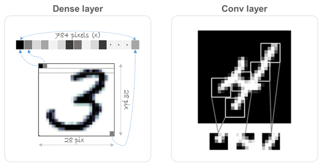

# Chap05 - 컴퓨터 비전을 위한 딥러닝

## 5.1 합성곱 신경망 소개

- 예제 코드 Jupyter Notebook → [[링크]](https://github.com/ExcelsiorCJH/Deep-Learning-with-Python/blob/master/Chap05-Deep_learning_for_computer_vision/5.1-introduction-to-convnets.ipynb)

### 5.1.1 합성곱(convolution) 연산

- 완전 연결 층(FC layer 또는 dense layer)과 합성곱 층 사이의 근본적인 차이는 다음과 같다.
  - `Dense` 층은 입력 특성 공간에 있는 **전역 패턴(global patterns)**을 학습한다.
  - 합성곱 층(`Conv2D`)은 **지역 패턴(local patterns)**을 학습한다. 
    - 이미지일 경우 작은 `2D` 윈도우(window = filter/kernel)로 입력에서 패턴을 찾는다.

