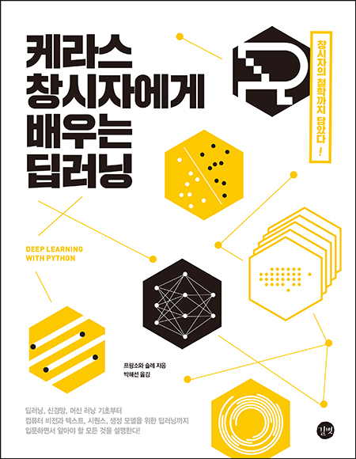

# Deep-Learning-with-Python

## 1. 교재

###  [케라스 창시자에게 배우는 딥러닝](http://www.yes24.com/24/Goods/65050162?Acode=101) (원서: [Deep Learning with Python](https://www.manning.com/books/deep-learning-with-python))

## 2. 목차

### Part1. 딥러닝의 기초 - Fundamentals of deep learning

- Chap01 - [딥러닝이란 무엇인가?](https://github.com/ExcelsiorCJH/Deep-Learning-with-Python/blob/master/Chap01-what_is_deep_learning/Chap01-what_is_deep_learning.md)
- Chap02 - [시작하기 전에: 신경망의 수학적 구성요소](https://github.com/ExcelsiorCJH/Deep-Learning-with-Python/blob/master/Chap02-mathematical_building_blocks_of_neural_networks/Chap02-mathematical_building_blocks_of_neural_networks.ipynb)

### Part2. 실전 딥러닝 - Deep learning in practice

## 3. 참고자료

- **GitHub** : https://github.com/rickiepark/deep-learning-with-python-notebooks